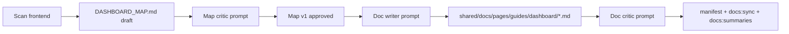

# Dashboard documentation pipeline

Public docs in `shared/docs/` today emphasize **API keys and redirect engine behavior**. Most customers operate through the **Angular dashboard** (`AppShellComponent`). This folder holds the machine- and human-readable map plus agent prompts to produce and validate dashboard guides.

## Artifacts

| File | Role |
|------|------|
| `DASHBOARD_MAP.md` | Source-of-truth **inventory** (routes, actions, wizards, gates). Draft until critic pass. |
| `../prompts/dashboard-map-critic.md` | Agent prompt: verify map vs `frontend/`; optional doc-split advisory (section C). |
| `../prompts/dashboard-doc-writer.md` | Agent prompt: write user-facing dashboard guides from the map. |
| `../prompts/dashboard-doc-critic.md` | Agent prompt: verify guides cover tasks and match the map + UI. |

Handoff / status: `.cursor/work/dashboard-docs-pipeline.md`

## Recommended workflow

1. Refresh `DASHBOARD_MAP.md` when routes or wizards change materially.
2. Run **map critic** — updated `DASHBOARD_MAP.md`, changelog, and **doc coverage advisory** (guide split readiness). Target `Status: reviewed` before writer.
3. Run **doc writer** — creates or updates markdown under `shared/docs/pages/guides/dashboard/`.
4. Register new pages in `shared/docs/manifest.yaml` (`category: guide`, routes `/docs/guides/<slug>` e.g. `/docs/guides/dashboard-overview`).
5. Run **doc critic** — file-specific review notes; writer fixes.
6. From repo root: `npm run docs:sync` then `npm run docs:summaries:all` (or CI on merge).

## Feeding the docs assistant

After dashboard guides exist:

- Summaries land in `shared/docs-summaries/` like other pages.
- Extend router/generator prompts (`backend-tools/src/docs-assistant/docs-assistant-prompts.ts`) to prefer **dashboard guide** catalog entries when questions mention UI, “dashboard”, “click”, “sidebar”, or “where do I”.
- Optional: add `DOCS_ASSISTANT_EXTRA_INSTRUCTIONS` snippet pointing at dashboard guide routes (keep honesty rules).

## What not to do

- Do not hand-edit `shared/docs-summaries/`.
- Do not cite internal paths like `frontend/src/...` in user-facing docs — use sidebar labels and routes (`/redirect-rules`, etc.).
