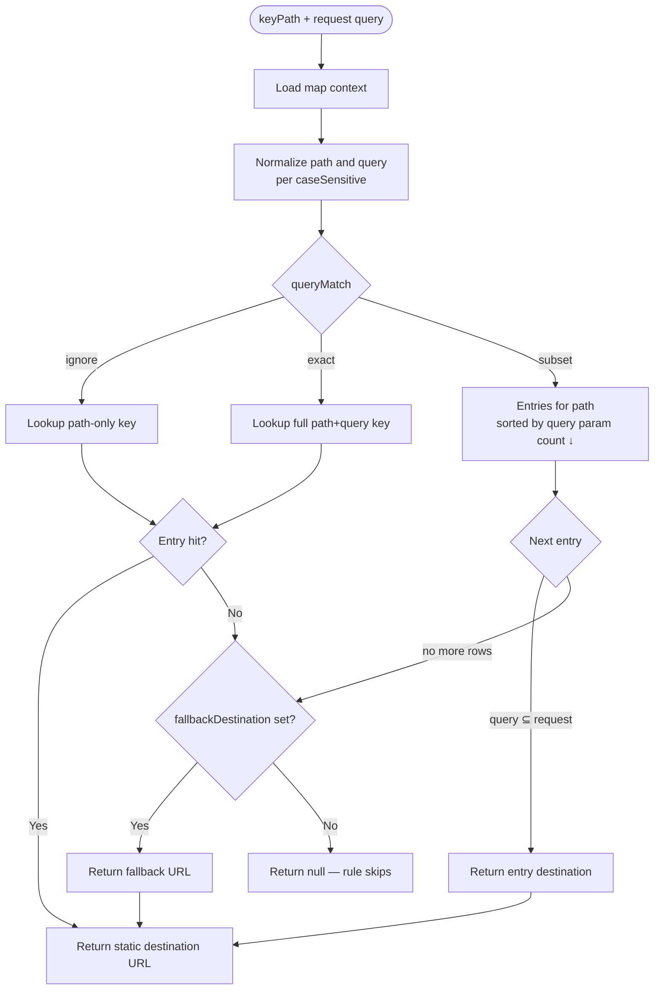

# Link maps — purpose, behavior, and safety

Link maps are keyed routing tables used by redirect rules. They map an incoming **key** (extracted from request path, optionally qualified by query) to a **destination URL**.

Start with the practical guides:

- [Link maps guide](../guides/link-maps.md) — workflow and examples
- [Redirect rules — link maps section](../guides/redirect-rules.md#link-maps--redirect-rules)

---

## What link maps are

```
Visitor → https://links.example.com/go/summer?utm=email
              │
              ▼
Redirect rule (source=/go, prefix, linkMapId=…)
              │ extracts key: "summer"
              ▼
Link map lookup
              │ entry "summer" → https://shop.example/sale
              ▼
302 redirect
```

Without link maps, each key would need its own redirect rule.

---

## Why they exist

| Benefit | Detail |
|---------|--------|
| Scale | Thousands of keys, one redirect rule |
| Operations | Bulk import/update/delete entries |
| Separation | Marketing owns entries; platform owns rule structure |
| Analytics | Per-key hit counts via rule analytics |

---

## Data model

### Link map

| Field | Purpose |
|-------|---------|
| `id`, `name`, `domainGroupId` | Identity and scope |
| `caseSensitive` | Key normalization behavior |
| `queryMatch` | `ignore`, `exact`, or `subset` |
| `fallbackDestination` | Optional default when no entry matches |
| `entriesCount` | Denormalized count (in list/get responses) |

### Link map entry

| Field | Purpose |
|-------|---------|
| `key` | Human-readable key as stored |
| `keyNormalized` | Canonical lookup form |
| `destination` | Redirect target URL (**static** `http://` or `https://` only — no template engine) |

Uniqueness: `@@unique([linkMapId, keyNormalized])` — no duplicate effective keys per map.

---

## Integration with redirect rules

Two independent configuration layers:

| Layer | Config | Role |
|-------|--------|------|
| Redirect rule | `source`, `pathMatch`, `queryMatch`, `linkMapId` | Match request; extract key from path |
| Link map | `queryMatch`, `caseSensitive`, entries | Resolve key (+ query) to destination |

**Rule requirements when `linkMapId` is set:**

- `pathMatch: prefix`
- `queryMatch: ignore`
- `destination: null`
- Plain path source (e.g. `/go`, `/v2/go`) — no `/pattern/flags` regex, no `*`, no `?`

**Key extraction:**

```
requestPath = /go/summer/extra
sourcePath  = /go
keyPath     = summer/extra
```

Then `resolveLinkMapDestination(linkMapId, keyPath, requestQuery)` runs.

**Prefix match before extraction:** The redirect rule must match the request path first (`pathMatch: prefix` with segment boundaries via `isPrefixMatch`). Only then is the suffix taken with `path.startsWith(sourcePath)` as `keyPath`. If the rule does not match (wrong method, prefix boundary, etc.), the map is never consulted.

**On miss:** if no entry and no `fallbackDestination`, the rule does not redirect — next rule in priority order is tried.

**Two rules, same prefix:** Only the first rule (by `priority`, then `createdAt`, then `id`) that returns a redirect target runs. A second link map rule on `/go` with lower priority never performs lookup for requests already handled by the higher rule. See [Link maps guide — two rules on the same prefix](../guides/link-maps.md#two-rules-on-the-same-prefix).

**Empty key:** Prefix rule `source: /go` with request `/go` only extracts key `""` — treat as a miss unless you configure fallback. See [Link maps guide — prefix-only requests](../guides/link-maps.md#when-visitors-hit-the-prefix-only).

---

## Key normalization rules

Applied on create, update, and import:

1. Trim whitespace
2. Tolerate optional leading `/` on input
3. If `caseSensitive: false` → lowercase path and query parts
4. Canonicalize query: sort by param name, then value
5. Reject full URLs as keys
6. Reject empty keys

Examples (`caseSensitive: false`):

| Input key | Normalized |
|-----------|------------|
| `Promo` | `promo` |
| `/Summer` | `summer` |
| `promo?utm=Email` | `promo?utm=email` |
| `promo?utm=b&utm=a` | `promo?utm=a&utm=b` |

---

## Query matching modes

### `ignore`

- Lookup uses the **extracted path key** only (`keyPath` from the redirect rule), not query params on the request
- Request query is ignored during resolution
- Entry keys should be **path-only** (for example `summer`, `partner/acme`). Query in the key string is stripped on write; resolution uses the path segment only (`promo`)

Use for: opaque short codes, simple `/s/{code}` patterns.

### `exact`

- Full normalized path+query must match entry key exactly
- Extra or missing request params → no match
- **Duplicate params:** Same multiset semantics as redirect rule `queryMatch: exact` — all values per key must match (order of repeated keys in the URL does not matter)

| Entry key (normalized) | Request query | Match? |
|------------------------|---------------|--------|
| `promo?tag=a&tag=b` | `?tag=b&tag=a` | Yes |
| `promo?tag=a` | `?tag=a&tag=b` | No (extra value for `tag`) |
| `promo?tag=a&tag=b` | `?tag=a` | No (missing value `b` for `tag`) |

Use for: params are part of link identity.

### `subset`

- Entry query params must all appear in request with matching values
- Extra request params allowed
- Entries sorted by specificity (**more query params first** — `countQueryParams` descending)
- First matching entry wins
- **Path-only entry** (key has no `?query`): matches **any** request query on that path — same as redirect rule `subset` with an empty source query

Use for: base link + UTM/ref variants.

Example (`subset`):

| Entry key | Request query | Match? |
|-----------|---------------|--------|
| `promo?utm=email` | `utm=email&cid=1` | Yes |
| `promo` | `cid=1` | Yes (less specific) |
| `promo?utm=email` | `utm=social` | No |

**Specificity tie-break:** For path `promo`, entries `promo?utm=a&utm=b` are tried before `promo?utm=a` because they carry more query params. Request `?utm=a&utm=b&ref=1` matches the more specific row first.

---

## Resolution flow

1. Load map context (cache or database)
2. Normalize incoming `keyPath` and query per map settings
3. Apply `queryMatch` strategy:
   - **ignore** → `entriesByKey.get(normalizedPath)` where `normalizedPath` comes from extracted path only
   - **exact** → lookup full normalized path+query key string
   - **subset** → iterate entries for path (sorted by query param count, descending), pick first matching query subset
4. Return entry destination, or `fallbackDestination`, or `null` (**static URL as stored** — no placeholder or conditional processing)

For **`subset`**: if the path matches one or more entries but **no entry’s query is a subset of the request**, resolution falls through to `fallbackDestination` (same as a total miss on that path).



---

## Safety and security

Before any write:

- URL-like values extracted from destinations
- Safety scanner validates targets
- Unsafe → `400 Bad Request`
- Scanner infrastructure error → `500 Internal Server Error` (fail-closed)

Applies to: entry create/update/import, map `fallbackDestination`.

---

## Cache model

Link map context is cached per `linkMapId` on the edge (entries, `queryMatch`, `caseSensitive`).

| Event | TTL / behavior |
|-------|----------------|
| Cache miss (map exists) | Load from DB, serialize, positive cache **up to 5 minutes** |
| Cache hit | Hydrate in-memory lookup maps from cached raw context |
| Map not found / deleted ID | Short negative cache (~**1 minute**) — repeated lookups return miss without hitting DB on every request |
| Any successful map or entry mutation | Cache invalidated immediately for that `linkMapId` |

**Runtime when a map is missing:** If a redirect rule still references a deleted or unknown `linkMapId`, `resolveLinkMapDestination` returns `null` (same as a key miss). The link map rule does not redirect — the engine tries the **next** rule. After a cache miss on a missing ID, negative cache can repeat that behavior briefly even if you recreate a map with the same ID (until cache expires or the rule is updated).

Typical propagation: immediate after successful API response under normal load.

Redirect rules on the edge use a separate per-hostname cache (also **up to 5 minutes** if invalidation fails). See [Redirect rules — propagation and caching](../guides/redirect-rules.md#propagation-and-caching).

Internal cache keys and invalidation hooks: [`shared/not-public/cache-and-data-layer.md`](../../../not-public/cache-and-data-layer.md).

---

## Operational constraints

- Map and entry counts limited by organization plan
- Cannot delete map referenced by active redirect rules
- Cannot change `caseSensitive` from `true` to `false` after creation
- Entries must belong to map in same organization (via domain group)

### Updating `queryMatch` or `caseSensitive`

When you `PUT` a link map and change `queryMatch` and/or `caseSensitive`, the API **re-normalizes every entry key** (`key` + `keyNormalized`) in a transaction. Destinations are unchanged. Plan for cache invalidation and brief propagation delay after bulk key rewrites.

Changing `caseSensitive` from `true` to `false` is blocked. Changing `false` to `true` is allowed but may change how existing keys normalize — review entries after update.

---

## Error semantics

| Status | Meaning |
|--------|---------|
| `404` | Map, entry, or domain group not accessible |
| `400` | Duplicate key, invalid transition, unsafe destination, invalid key format |
| `500` | Safety scanner failure |

---

## Choosing `queryMatch` — decision guide

```
Are query params part of the link identity?
├── Yes → exact or subset
│         ├── Fixed param set only? → exact
│         └── Base link + optional extra params? → subset
└── No → ignore
```

---

## Practical examples

### Ignore — classic short links

Map: `queryMatch: ignore`  
Entries: `abc`, `xyz`, `launch`  
Rule: `source: /s`, prefix, linkMapId

### Subset — campaign variants

Map: `queryMatch: subset`, fallback set  
Entries:

- `deal?utm_source=email`
- `deal?utm_source=social`
- `deal`

Rule: `source: /c`, prefix

### Exact — strict param matching

Map: `queryMatch: exact`  
Entry: `invite?token=abc123`  
Only that exact query combination matches.

---

## Related guides

- [Link maps guide](../guides/link-maps.md)
- [Link map entries guide](../guides/link-map-entries.md)
- [Redirect rules guide](../guides/redirect-rules.md)
- [Redirect engine concepts](./redirect-engine-concepts.md)
