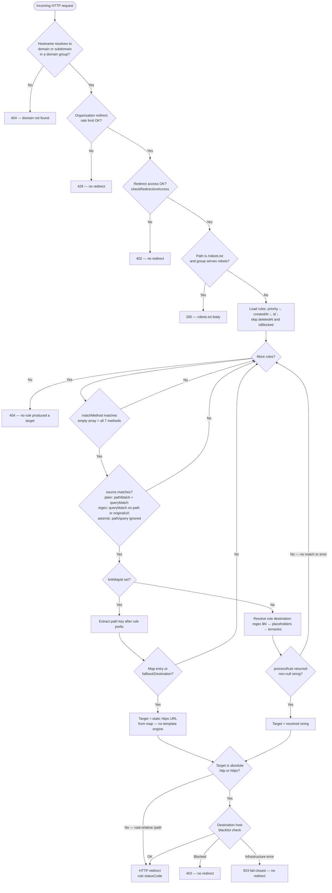
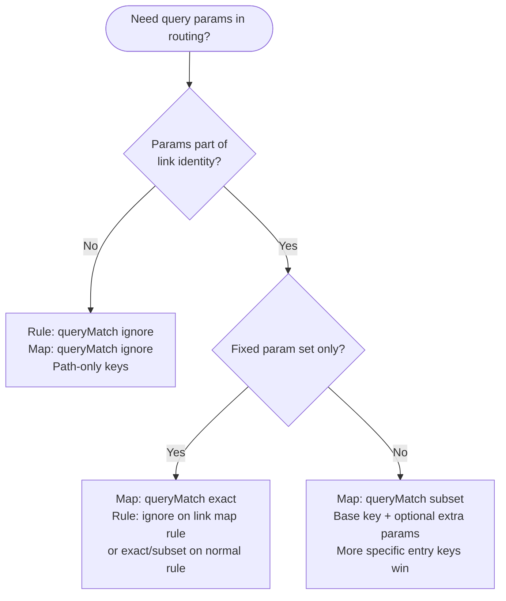

# Redirect engine concepts

This page documents the LinkShift redirect engine in depth: placeholders, modifiers, conditional logic, and edge cases.

For rule configuration, matching modes, and link map integration, start with the [Redirect rules guide](../guides/redirect-rules.md).

---

## Request variables

When a rule matches, the engine builds a variable map from the incoming request. Use these in `{placeholder}` syntax inside destinations and conditions.

### Domain variables

Parsed from request hostname (`Host` header).

| Placeholder | Example hostname | Example value |
|-------------|------------------|---------------|
| `{domain.fqdn}` | `deep.sub.example.co.uk` | `deep.sub.example.co.uk` |
| `{domain.label}` | `deep.sub.example.co.uk` | `deep.sub.example.co` |
| `{domain.root}` | `deep.sub.example.co.uk` | `co` |
| `{domain.extension}` | `deep.sub.example.co.uk` | `sub.example.co.uk` |
| `{domain.subdomain}` | `deep.sub.example.co.uk` | `deep.sub.example` |
| `{domain.subdomains.0}` | `deep.sub.example.co.uk` | `deep` |
| `{domain.subdomains.1}` | `deep.sub.example.co.uk` | `sub` |

#### How labels are derived (important)

The engine splits the hostname on `.` and assigns:

- `{domain.root}` — second-to-last label when there are at least two labels; otherwise the only label (e.g. `localhost`).
- `{domain.label}` — all labels **except the last** (`hostParts.slice(0, -1).join('.')`).
- `{domain.extension}` — all labels **except the first** (`hostParts.slice(1).join('.')`).
- `{domain.subdomain}` / `{domain.subdomains.N}` — labels before the last two (empty when the host has only one or two labels).

**Not the registrable apex:** For `deep.sub.example.co.uk`, `{domain.root}` is `co`, not `example.co.uk`. For apex-style redirects on complex TLDs, prefer `{domain.extension}` or `{domain.fqdn}` and verify with [simulate](../guides/redirect-rules.md#simulate-before-rollout).

**IDN / punycode hostnames:** The engine parses whatever hostname the edge receives (usually punycode ASCII, for example `xn--…`). `{domain.*}` placeholders reflect that string — not the Unicode display form visitors see in the browser bar. Test with the same hostname shape you configure on the domain (`links.example.com` vs punycode) via [simulate](../guides/redirect-rules.md#simulate-before-rollout).

For single-part hostnames like `localhost`:

| Placeholder | Value |
|-------------|-------|
| `{domain.fqdn}` | `localhost` |
| `{domain.root}` | `localhost` |
| `{domain.label}` | *(empty)* |
| `{domain.extension}` | *(empty)* |
| `{domain.subdomain}` | *(empty)* |

For a standard two-label hostname (`example.com`):

| Placeholder | Value |
|-------------|-------|
| `{domain.fqdn}` | `example.com` |
| `{domain.label}` | `example` |
| `{domain.root}` | `example` |
| `{domain.extension}` | `com` |
| `{domain.subdomain}` | *(empty)* |

For `links.example.com` (three labels):

| Placeholder | Value |
|-------------|-------|
| `{domain.fqdn}` | `links.example.com` |
| `{domain.root}` | `example` |
| `{domain.extension}` | `example.com` |
| `{domain.subdomain}` | `links` |

### Path variables

| Placeholder | Request path | Value |
|-------------|--------------|-------|
| `{path}` | `/user/123/profile` | `user/123/profile` (no leading slash) |
| `{segments.0}` | `/user/123/profile` | `user` |
| `{segments.1}` | `/user/123/profile` | `123` |
| `{segments.2}` | `/user/123/profile` | `profile` |

Segment index starts at `0`. Only segments that exist in the request path are set. If `{segments.N}` is missing and there is **no modifier chain**, the placeholder is left **unchanged** in the output (literal `{segments.N}`). With a modifier chain but no value, the raw key name may be passed into modifiers.

**URL fragments (`#…`):** Browsers do not send the fragment to the server. `{path}`, `{segments.N}`, and `{query.*}` never see `#section` — only the path and query the edge receives. Route on fragments in the browser (client-side), not in redirect rules.

### Query variables

Each query parameter becomes `{query.paramName}`:

Request `/search?q=shoes&color=red`  
→ `{query.q}` = `shoes`, `{query.color}` = `red`

**Placeholders vs matching:** In `{query.*}` substitution, when a param appears multiple times, the engine walks `URLSearchParams` in order and **overwrites** the same key — the **last** occurrence in the query string wins (not the first).

Request `/promo?u=1&u=2` with `destination: "https://example.com/?u={query.u}"`  
→ `https://example.com/?u=2`

Rule **matching** (`queryMatch`) uses a separate map that keeps **all** values per key (sorted) and supports duplicate values in `exact` / `subset` checks.

### Request metadata

| Placeholder | Source |
|-------------|--------|
| `{method}` | HTTP method (`GET`, `POST`, …) |
| `{ip}` | Client IP from the edge request (`req.ip` or socket address) |
| `{user-agent}` | User-Agent header |
| `{accept-language}` | Raw `Accept-Language` header (empty string if absent) |
| `{accept-language.primary}` | First language range from the header (tag before `;`, list order — not q-value ranking) |

There are **no** generic `{header.*}` or `{cookie.*}` placeholders. Route on browser language via `{accept-language}` / `{accept-language.primary}`, on User-Agent or IP via `{user-agent}` / `{ip}`, or with path/query conditionals. Custom request headers (including `Cookie`) are not available — **cookie-based routing is not supported**.

**`{accept-language.primary}` parsing:** The engine takes the first comma-separated range and strips any `;q=…` suffix. Example: `pl-PL,pl;q=0.9,en;q=0.8` → `pl-PL`. Use modifiers such as `to_lower_case` and `includes` in conditionals — same pattern as `{user-agent}`. Values are client-controlled (browsers can spoof them); do not use language routing for authorization.

**Simulate and redirect tests:** Pass `headers.accept-language` (or rely on the browser header on live traffic). Omitted header → empty `{accept-language}` and `{accept-language.primary}`.

**`{ip}` on live traffic:** The engine sets `ip` from `req.ip`, then `req.socket.remoteAddress`. With `trust proxy` enabled on the edge, `req.ip` often reflects the client IP from `X-Forwarded-For` when the proxy is configured correctly. If both are missing (unusual proxy or local setup), `{ip}` is **undefined** — without a modifier chain the literal `{ip}` is left in the output; with modifiers the raw key name may be passed into the chain.

**IPv6:** `{ip}` can be an IPv6 address (for example `2001:db8::1`) when the edge provides one. There is no special normalization — use the same format you expect in production when testing with [simulate](../guides/redirect-rules.md#simulate-before-rollout).

**Simulate:** When `ip` is omitted on a simulate entry, it defaults to **`127.0.0.1`**. Always pass explicit `ip` when testing IP-based conditionals so simulate matches production expectations.

### Planned: country routing (GeoIP addon)

Country-based routing via `{geo.country}` is a **planned feature** — it is **not available** today.

| Topic | Status |
|-------|--------|
| `{geo.country}` placeholder | **Rejected** at API validation (`Unknown variable: "geo.country"`) — see `rule-validator.service.spec.ts` |
| Runtime / simulate | No GeoIP lookup; `extractVariables` has no `geo` branch (comment-only future hook in `redirect.service.ts`) |
| Dev / localhost stub | **None** — do not assume `PL` on `localhost` or `US` as a default in simulate or live traffic |
| Workarounds today | `{accept-language}`, `{ip}`, `{user-agent}`, path/query conditionals, or separate rules per domain |

Interested in country-based routing for your organization? Contact LinkShift support — we use demand to prioritize the GeoIP addon.

---

## Modifiers

Append modifiers after a colon. Chain with dots:

```
{query.code:to_upper_case.url_encode}
```

The engine splits placeholder content on the **last** colon: `{query.utm:source:to_lower_case}` uses key `query.utm:source` and modifier chain `to_lower_case`. Placeholder names cannot contain `:`.

Modifiers work on **function placeholders** in destinations too, for example `{random(0,9):divide_10.divide_10}`.

**Chain order:** Modifiers run **left to right** in the dot chain (`:first.second.third` → apply `first`, then `second`, then `third` on the result).

| Modifier | Effect | Example input → output |
|----------|--------|------------------------|
| `to_lower_case` | Lowercase | `HELLO` → `hello` |
| `to_upper_case` | Uppercase | `hello` → `HELLO` |
| `url_encode` | URI encode | `a b` → `a%20b` |
| `url_decode` | URI decode | `a%20b` → `a b` |
| `base64_encode` | Base64 encode | `test` → `dGVzdA==` |
| `to_iso_string` | ISO-8601 timestamp | `1700000000000` → `2023-11-14T22:13:20.000Z`; empty or unparseable input → **current time** as ISO |
| `auto_trailing_slash` | Add `/` if missing | `path` → `path/` |
| `multiply_10` | × 10 | `5` → `50` |
| `divide_10` | ÷ 10 | `50` → `5`, `123` → `12.3` (decimal-string logic for digit inputs; other shapes fall back to `Number(value)/10`) |
| `add_10` | + 10 | `5` → `15` |
| `multiply_2` | × 2 | `10` → `20` |
| `round` | Round to integer | `10.6` → `11` |

| Phase | Unknown modifier |
|-------|------------------|
| **API create/update** | Validation error (`400`) — fix before save |
| **Runtime** | Skipped with a warning; previous value kept |

Non-numeric input with math modifiers may produce `NaN`. `url_decode` on invalid percent-sequences keeps the previous value (same as other runtime manipulator errors). `divide_10` uses decimal-string shifting for digit-only inputs; other shapes use floating `Number(value)/10`.

**Numeric modifier examples (destinations):**

```json
{
  "source": "/score/42",
  "destination": "https://api.example.com/v{segments.1:multiply_2}"
}
```

Request `/score/42` → `https://api.example.com/v84` (`42` × 2).

```json
{
  "source": "/tier/5",
  "destination": "https://billing.example.com/plan-{segments.1:add_10}"
}
```

Request `/tier/5` → `https://billing.example.com/plan-15`.

```json
{
  "source": "/rating/4.7",
  "destination": "https://reviews.example.com/stars-{segments.1:round}"
}
```

Request `/rating/4.7` → `https://reviews.example.com/stars-5`.

**`random()` in conditions vs destinations:** `{random(0,100)}` in a destination and `random(0,100)` inside a ternary condition are resolved in **separate steps** — each draw is independent within one redirect.

**Do not use `{random(...)}` inside the condition segment** of a ternary. Conditions call `random(min,max)` **without** curly braces (see [Functions in conditions](#functions-in-conditions-no-curly-braces)). `{random(0,100)}` in the condition part is treated as a destination-style placeholder during step 2 of resolution, not as the condition function.

---

## Function placeholders (in destinations)

Use inside `{…}` in destination strings. Resolved at redirect time (not pre-extracted from the request).

### `{time()}`

Returns current timestamp in milliseconds.

```json
{ "destination": "https://example.com?t={time()}" }
```

With modifier:

```json
{ "destination": "https://example.com?t={time():to_iso_string}" }
```

### `{random(min,max)}`

Returns a random integer. **Both bounds are inclusive** (`random(0,9)` can return `0` or `9`).

| Syntax | Range (inclusive) |
|--------|-------------------|
| `{random()}` | `0` to `Number.MAX_SAFE_INTEGER` |
| `{random(100)}` | `0` to `100` |
| `{random(-10,20)}` | `-10` to `20` |

Arguments must be safe integers. Invalid args fail validation at rule save time.

If `min > max`, the engine **swaps** the bounds before drawing.

Used heavily in A/B routing conditions (see below — condition syntax is **without** curly braces). For `random(0,100) < 30`, values `0`–`29` take the true branch; `30` and above take the false branch.

---

## Functions in conditions (no curly braces)

In ternary **conditions**, call `time()`, `random(min,max)`, and `datetime('…')` directly — not as `{time()}`:

```
random(0,100) < 30 ? https://a.example.com : https://b.example.com
time() > datetime('2025-12-01') ? /live : /soon
```

| Context | Syntax | Example |
|---------|--------|---------|
| Destination URL | `{time()}`, `{random(0,100)}` | `https://x.com?t={time()}` |
| Ternary condition | `time()`, `random(0,100)` | `random(0,100) < 50 ? … : …` |

**`datetime('…')` is condition-only.** There is no `{datetime(...)}` placeholder in destinations. Use `time() > datetime('2025-06-01') ? …` in the ternary condition, not inside `{…}`.

---

## Escaping literal braces

To output literal `{` or `}` in destination, double them:

```
https://example.com/{{not-a-placeholder}}
```

→ `https://example.com/{not-a-placeholder}`

The placeholder regex only matches single braces (`{…}`), so doubled braces are not treated as variables. Unescaping runs **after** placeholder substitution (`{{` → `{`, `}}` → `}`). Covered by `redirect.service.spec.ts` (double-brace destination).

This applies anywhere in the destination string, including inside ternary branches.

---

## Missing placeholders

If a placeholder key does not exist and has no modifier chain, it is **left unchanged** in output:

```
Destination: https://example.com/{missing_var}
Result:      https://example.com/{missing_var}
```

If a modifier chain is present but value is missing, the raw key name may be used as input to modifiers.

---

## Conditional routing syntax

Destination can be a ternary expression:

```
Condition ? TrueBranch : FalseBranch
```

### Destination resolution order (within one rule)

After the rule **matches** the request (path, query, method):

1. Regex capture groups (`$0`, `$1`, …) are substituted in the rule `destination` string (non–link-map rules only).
2. **All** `{placeholders}` in that string are resolved (entire string, not only inside quoted condition operands).
3. Top-level ternary is parsed (respects parentheses and quoted strings; skips `://` in URLs).
4. Each condition is evaluated (`time()`, `random()`, `datetime()`, comparisons). Operand strings were already substituted in step 2.
5. The chosen branch is processed recursively (may contain nested ternaries, max depth **32**).
6. The result is the redirect target string for that rule.

URLs starting with `http://`, `https://`, or `/` are treated as literal leaf destinations and are not parsed as nested conditionals.

**Leaf paths with query strings:** A branch that starts with `/` is a leaf, including when it contains `?` — for example `/sale?ref=email` is **not** parsed as a nested conditional (the `?` is part of the URL, not ternary syntax). Put routing logic in the condition segment, not after `?` in a root-relative leaf.

**Placeholders before ternary parsing:** Step 2 substitutes `{…}` across the **entire** destination string before the top-level `?` / `:` are interpreted. If a placeholder expands to text containing `?` or `:`, the parser may mis-detect a ternary. Avoid dynamic values that inject those characters; use nested ternaries or static branch URLs instead.

**Link map rules** (`linkMapId` set, `destination: null`): steps 1–5 apply only to map **entry** / `fallbackDestination` URLs as stored (static `http://` / `https://` — no template engine). The rule itself only matches and extracts the lookup key.

### Live redirect pipeline (end-to-end)

```
Request
  → Organization redirect rate limit (plan redirectionLimitPerMinute) — 429 if exceeded
  → Organization redirect access (checkRedirectionAccess) — 402 if suspended or over plan limits
  → robots.txt policy (if path is /robots.txt) — not a redirect rule; rate limit and access checks already applied
  → Load rules: deletedAt null, isBlocked false, order priority desc, createdAt desc, id desc
  → For each rule:
       → match source (matchMethod; plain path: pathMatch + queryMatch; regex: queryMatch only; *: no path/query filter)
       → if linkMapId: resolve key in link map → static URL or skip rule on miss
       → else: resolve destination ($N → placeholders → conditionals)
       → if absolute target URL: platform domain blacklist → 403 if blocked
       → if blacklist check errors: 503, no redirect (fail-closed)
       → else: HTTP redirect with rule statusCode
  → No target: 404
```

Root-relative targets (`/path`) skip domain blacklist (no host to check). See [Destination domain blacklist](#destination-domain-blacklist-runtime).

Simulate follows matching and destination resolution but **does not** enforce redirect rate limits. Domain blacklist checks are **opt-in** via `checkDestinationBlacklist: true` on `POST /api/v1/redirect-rules/simulate` (default `false`). When enabled, absolute targets use the same blacklist gate as live traffic; results keep `matched: true` and set `statusCode` to **403** or **503** with `blacklistBlocked` / `blacklistCheckFailed` as appropriate. It **does** call `checkRedirectionAccess` — a suspended organization or edge paywall can return **`402`** on the whole simulate request before any entry runs. See [Redirect rules — simulate vs live](../guides/redirect-rules.md#simulate-vs-live-redirect).

### Routing decision flow (diagram)

End-to-end path for a **live** redirect on a custom domain or LinkShift subdomain. Management API (`simulate`) follows the rule loop and destination resolution; it skips rate limits and runs blacklist checks only when `checkDestinationBlacklist: true`; it still enforces organization access (`402` when applicable). See [Redirect rules — simulate vs live](../guides/redirect-rules.md#simulate-vs-live-redirect).



**Rule loop takeaway:** A rule whose `source` matches but produces **no target** (link map miss without fallback, `processRule` returned `null`, or runtime error) does **not** stop evaluation — the engine continues to `NEXT`.

**Link map branch:** When `linkMapId` is set, a matching rule runs `processRule` on `destination: null` (yields `""`, which is **not** `null`), then link map lookup. **Lookup miss** (no entry, no fallback) skips the rule — not because `processRule` returned `null`.

**Link map vs dynamic rule:** Map rows and `fallbackDestination` are static URLs only. Dynamic placeholders, ternaries, and `$N` belong on a normal redirect rule `destination` (without `linkMapId`).

#### Choosing `queryMatch` (rule vs link map)

Redirect rules and link maps each have their own `queryMatch`. Link map rules **must** use `ignore` on the rule; query-aware routing happens on the **map**.



See [Link map concepts — choosing queryMatch](./link-map-concepts.md#choosing-querymatch--decision-guide) and [Redirect rules — query matching](../guides/redirect-rules.md#query-matching-querymatch).

### Condition operators

| Operator | Meaning | Example |
|----------|---------|---------|
| `==` | Equal (**loose**, like JavaScript `==`) | `'{method}' == 'GET'`, `5 == '5'` → true |
| `!=` | Not equal | `'{method}' != 'POST'` |
| `<` | Less than | `random(0,100) < 30` |
| `>` | Greater than | `time() > datetime('2025-01-01')` |
| `<=` | Less or equal | `10 <= 10` |
| `>=` | Greater or equal | `5 >= 3` |
| `~=` | Regex match | `'{path}' ~= /admin/i` |
| `includes` | Substring (**case-sensitive**) | `'{user-agent}' includes 'Mobile'` — use `{user-agent:to_lower_case}` when matching case-insensitively |

Quote string operands with single or double quotes: `'value'` or `"value"`.

**One operator per condition:** Each condition segment supports a **single** comparison (for example `'{path}' includes 'shop'`). There is no `&&`, `||`, or chained comparison like `a < b < c`. Combine logic with nested ternaries.

**Strict equality:** Use `==` and `!=` only. `===` and `!==` are **rejected** at API validation.

**Operator precedence (first match wins):** The parser scans for one operator per condition, in this order: `==`, `!=`, `<=`, `>=`, `~=`, `includes`, `<`, `>`. Longer operators are tried before shorter ones at the same position (for example `<=` before `<`). You cannot write `a < b < c` — use nested ternaries.

**Missing or invalid condition:** If no operator is found (for example `random(0,100)` without `<` / `>`), or `random()` / `datetime()` is invalid at runtime, the condition evaluates to **false** (false branch).

### Functions in conditions

| Function | Returns | Example |
|----------|---------|---------|
| `time()` | Current ms timestamp | `time() > datetime('2025-06-01')` |
| `random(min,max)` | Random integer | `random(0,9) < 5` |
| `datetime('date')` | Timestamp ms (UTC) | `datetime('2024-06-15')` |
| `datetime('date', 'TZ')` | Timestamp ms in timezone | `datetime('2024-06-15 08:00', 'America/New_York')` |

Date-only strings default to `00:00 UTC`.

| `datetime(...)` issue | API create/update | Runtime (live / simulate) |
|------------------------|-------------------|---------------------------|
| Invalid timezone (for example `Mars/City`) | **`400`** — validation error | Rule should not exist |
| Invalid date string | **`400`** when caught by validator | Condition evaluates to **`false`** (`NaN` comparison) |
| Valid syntax | Allowed | Timestamp ms used in comparisons |

Invalid `random(...)` in a condition (bad args at runtime) also yields `NaN` → false branch. In destinations, invalid `{random(...)}` fails validation at rule save time when args are not safe integers.

### Regex match (`~=`)

Right side can be a **plain pattern string** or `/pattern/flags`:

```
'{path}' includes 'admin'     ← substring (separate operator)
'{path}' ~= admin             ← RegExp('admin') — pattern match, not substring
'{user-agent}' ~= /iPhone/i
'{path}' ~= /admin/
```

A plain right-hand side (no slashes) is passed to `new RegExp(pattern)` with no flags. Use `/pattern/i` when you need case-insensitivity.

**Flags in conditions differ from regex `source`:** Rule `source` stored as `/pattern/flags` accepts `d`, `g`, `i`, `m`, `s`, `u`, `v`, `y`. The `~=` operator in ternary conditions only parses `/pattern/flags` with **`g`, `i`, `m`, `s`, `u`, `y`** — not `d` or `v`. For example `'{path}' ~= /foo/d` does not apply the `d` flag; use `/foo/i` or a plain pattern string instead.

### Nested logic (no `&&` / `||`)

Logical AND is simulated with nested ternaries:

```
// If path includes 'shop' AND always true → /commerce
'{path}' includes 'shop' ? (1 == 1 ? /commerce : /blog) : /home
```

If-else-if chain:

```
'{method}' == 'GET' ? /get : ('{method}' == 'POST' ? /post : /other)
```

### Parentheses and URL colons

Parser skips `://` in URLs when finding ternary `:`. Operators inside quoted strings are ignored.

### Nesting limit

Maximum **32** nesting levels. The API validator rejects destinations deeper than 32 at create/update. At runtime, exceeding the limit throws during parsing — the rule is **skipped** (logged as error) and subsequent rules still evaluate.

---

## Regex sources

Store as string: `/pattern/flags`

Valid flags: `d`, `g`, `i`, `m`, `s`, `u`, `v`, `y` (JavaScript RegExp flags).

Examples:

| Source | Matches |
|--------|---------|
| `/^\\/blog\\/(.+)$/` | `/blog/any-slug` |
| `/^\\/go\\/([^/]+)\\/([^/]+)$/` | `/go/docs/api` |
| `/^\\/(.*)$/` | Any path |

Capture groups populate `$0` (full match), `$1`, `$2`, … in destination **before** placeholder resolution. Validation counts **capturing** groups only (`(?:…)` non-capturing groups are not counted toward `$N` limits).

**`$N` only on regex `source`:** Substitution runs only when `source` is stored as `/pattern/flags`. On a **plain path** or wildcard rule, any `$N` in `destination` (including `$0`) returns `400` validation — use a regex `source` when you need capture substitution.

**Missing or non-participating `$N` at runtime:**

| Case | Result |
|------|--------|
| `$N` in `destination` where `N` exceeds capturing groups in `source` | **`400` at save** — `Destination uses group $N, but source only has …` |
| `$N` on plain path / `*` / link map rule | **`400` at save** — capture substitution requires regex `source` |
| Optional group did not match this request (e.g. `(…)?` absent) | Replaced with the literal text **`undefined`** in the URL (`redirect.service.ts` — `String.replace` with `undefined`) |
| `{placeholder}` missing (no modifier chain) | Left **unchanged** as `{placeholder}` — different from `$N` |

Prefer required capturing groups or separate rules when a suffix is optional; test edge paths with [simulate](../guides/redirect-rules.md#simulate-before-rollout).

Example — `$0` is the full path match:

```json
{
  "source": "/^\\/archive\\/(.+)$/",
  "destination": "https://archive.example.com/redirect?matched=$0&slug=$1",
  "queryMatch": "ignore"
}
```

Request `/archive/2024/post` → `matched=/archive/2024/post`, `slug=2024/post`.

With `queryMatch: ignore`, regex matches path only. Otherwise matches full path + query (`originalUrl`).

**Flag `g` (global):** Avoid storing regex sources with a `g` flag unless you intend it. `String.match()` on a global regex can behave differently with capture groups than a non-global pattern. Prefer patterns without `g` for redirect `source` values.

**Preserve query on www → apex:** For `source: /^\\/(.*)$/` and `destination: https://{domain.extension}/$1`, do not use `queryMatch: ignore` — use default `exact` so `$1` includes the query string. See `redirect.service.spec.ts` (www host → apex with query).

### Plain path vs regex — do not confuse them

Any `source` that looks like `/pattern/flags` (leading `/`, another `/`, then **only** valid RegExp flag letters `d`, `g`, `i`, `m`, `s`, `u`, `v`, `y`) is stored and executed as a **regex**, not a literal path.

| `source` | Interpreted as |
|----------|----------------|
| `/^\\/blog\\/(.+)$/` | Regex (intended) |
| `/v2/go` | Plain prefix path (suffix `go` is not valid flags) |
| `/campaign/i` | **Regex** pattern `campaign`, flag `i` — not path `/campaign/i` |
| `/api/v1/g` | **Regex** pattern `api/v1`, flag `g` |

Use explicit regex syntax (`/^\\/campaign\\/i$/` or similar) when you need metacharacters. Use plain segments without a trailing `/flags` suffix for literal paths. Link map rule sources must be plain paths (regex form is rejected at validation).

---

## Wildcard source (`*`)

Matches all requests (subject to `matchMethod` only). Typical pattern:

```json
{ "source": "*", "destination": "...", "priority": 0 }
```

**`pathMatch` and `queryMatch` are ignored** for `source: "*"`. The API still stores those fields, but runtime always treats the rule as matched (before destination resolution). Use a plain path `source` with embedded `?…` or conditional logic when query params must gate matching.

Cannot be combined with `linkMapId`.

---

## Regex and plain path — which fields apply

| `source` form | `pathMatch` | `queryMatch` | `$N` in `destination` | `linkMapId` | `matchMethod` |
|---------------|-------------|--------------|------------------------|-------------|---------------|
| Plain path (e.g. `/go`, `/promo?utm=x`) | Used (`exact` or `prefix`) | Used | **No** — API rejects any `$N` in `destination` (see [regex sources](#regex-sources)) | Allowed — see link map row | Used |
| `/pattern/flags` regex | **Ignored** (anchor in pattern) | Used (`ignore` → path only; else `originalUrl`) | **Yes** — substituted before `{placeholders}` | **No** — cannot combine with `*`; API rejects regex for link map rules | Used |
| `*` wildcard | **Ignored** | **Ignored** | **No** (not a regex `source`) | **No** | **Only** gate besides destination logic |
| Link map rule (plain `source` + `linkMapId`) | **`prefix` only** (API) | **`ignore` only** (API) | **No** on rule (`destination: null`); map URLs are static | **Required**; `destination` must be `null` | Used — e.g. `["GET"]` so `POST /go/x` falls through |

### Regex match target (`originalUrl`)

For regex rules with `queryMatch` other than `ignore`, the engine matches against **`originalUrl`** (path + query as on the request). That value comes from `req.originalUrl` when present, otherwise `pathname + search`. With `queryMatch: ignore`, only `pathname` is matched.

Capture groups `$0` (full match), `$1`, … are substituted **only** when `source` is stored as `/pattern/flags`. Plain-path and wildcard rules do not substitute `$N`; the API rejects any `$N` in `destination` on create/update.

---

## Link map key extraction

For link map rules only:

```
sourcePath = path portion of rule source (no query)
keyPath    = requestPath with sourcePath prefix removed (leading slash stripped from remainder)
```

**Order matters:** The rule must **match** first (`pathMatch: prefix` with segment boundaries via `isPrefixMatch`, plus `queryMatch: ignore` on the rule). Only then is `keyPath` extracted. A request like `/golang/summer` does **not** match rule `source: /go`, so no key is extracted.

Simulate and analytics return this **raw** `keyPath` (for example `Summer`). The link map resolver then **normalizes** it per map `caseSensitive` (for example `summer`) before lookup.

| Rule source | Request path | Extracted key |
|-------------|--------------|---------------|
| `/go` | `/go/summer` | `summer` |
| `/go` | `/go/summer/extra` | `summer/extra` |
| `/long` | `/long/abc` | `abc` |
| `/long/` | `/long/abc` | `abc` |
| `/go` | `/go` only (no suffix) | `""` (empty string) — lookup rarely useful; prefer a named key or fallback rule |
| `/go` | `/go/` only | Matches (prefix); key `""` |
| `/long/` | `/long` only (no trailing segment) | rule does **not** match |
| `/long/` | `/long/` | Matches; key `""` |

**Trailing slash on rule `source` (prefix):** For suffixed paths (`/go/summer`), `/go` and `/go/` usually extract the same key. Asymmetric matching: `source=/go` matches request `/go/`; `source=/go/` does **not** match request `/go` alone. Prefer `/go` without a trailing slash for short-link prefixes.

**Plain path only:** Multi-segment prefixes are allowed (e.g. rule `source: /v2/go`, request `/v2/go/summer` → key `summer`). Stored `/pattern/flags` regex form is rejected. You can also use a short rule prefix and multi-segment **entry keys** (rule `/s`, key `docs/api/v2`).

Extracted key + **request query** (not query embedded in rule `source`) are passed to link map resolver. See [Link map concepts](./link-map-concepts.md).

---

## Rule processing edge cases

### Malformed rule at runtime

If a rule throws during processing (recursion limit, unexpected error), it is **skipped** and the next rule is tried. The server keeps responding.

### Blocked rules (`isBlocked`)

Rules with `isBlocked: true` are excluded from matching entirely.

| Topic | Behavior |
|-------|----------|
| Public API | `isBlocked` is returned on rule GET/list; it is **not** a create/update field |
| On create/update | Destination safety scan runs on rules **with** a non-null `destination` (see [Redirect rules — validation](../guides/redirect-rules.md#validation)) |
| Ongoing safety monitoring | The platform runs **automated destination safety checks** on create/update and may re-check rules with a non-null `destination` over time. Unsafe URLs → `isBlocked: true`, possible domain blacklist update, **email to the rule’s organization owner**. Link map rules (`destination: null`) are not monitored on the rule record — entry and `fallbackDestination` URLs are validated on map/entry write instead. |
| Unblock via API | Any successful `PUT` on the rule sets `isBlocked: false` and clears `blockedAt` — even if you only change unrelated fields. Fix unsafe URLs first; ongoing monitoring can block the rule again if destinations stay unsafe. |

`isBlocked` on the rule record is separate from runtime **403** when a resolved redirect target host is on the domain blacklist (see below).

### Destination domain blacklist (runtime)

After a rule produces a target, the edge may block the redirect based on the **destination host**:

| Resolved target | Blacklist check |
|-----------------|-----------------|
| `https://…` or `http://…` | Host extracted and checked against platform domain blacklist |
| Root-relative `/path` | **Skipped** — no absolute host to check |
| Link map static URL | Same as `https://` — host is checked |

If the host is blacklisted, the visitor gets **`403 Forbidden`** (`Destination domain is blocked`) instead of a redirect. This is separate from `isBlocked` on the rule record.

**Blacklist service errors:** If the blacklist check throws (infrastructure error), the visitor gets **`503 Service Unavailable`** (`Couldn't verify redirect destination. Try again in a moment.`) and **no redirect** is issued (fail-closed). Live traffic never falls through to an unverified redirect when the check fails.

Simulate does **not** run blacklist checks by default — it can return `matched: true` with a target that live traffic would block with **403** or **503**. Pass **`checkDestinationBlacklist: true`** on the simulate request for CI parity (see [Redirect rules — simulate vs live](../guides/redirect-rules.md#simulate-vs-live-redirect)).

### Link map match pipeline

For rules with `linkMapId`, stored `destination` is always `null`. Runtime still runs `processRule` first (path/`matchMethod`/`queryMatch` on the rule):

1. If the rule does not match → skip rule (`null`).
2. If it matches → `processRule` resolves placeholders/conditionals on an empty string (yields `""`, which is **not** `null`).
3. `getRedirectMatch` then calls link map lookup (`resolveLinkMapTarget`) and uses the **static** entry or `fallbackDestination` URL.
4. If lookup returns `null` (no entry, no fallback) → **no redirect from this rule** — next rule in priority order.

Dynamic `destination` logic on the rule record itself is never used when `linkMapId` is set.

### Link map miss

When link map returns `null` (no entry, no fallback), the link map rule **does not produce a redirect** — evaluation continues to the next rule.

### Link map entry destinations

Destinations stored in link map **entries** and `fallbackDestination` are **static** `http://` or `https://` URLs. They are **not** processed by the redirect engine template (no `{placeholders}`, no ternary conditionals, no `$1` from rule regex). Dynamic routing belongs on the **redirect rule** `destination`, or use separate entries per variant.

### Empty or whitespace-only target

API validation requires a non-empty `destination` string on create/update (for rules without `linkMapId`). At **runtime**, a conditional can still resolve to `""` after matching — that rule **wins** and the edge issues `res.redirect(statusCode, "")` (broken redirect). Avoid empty branches; use an explicit URL or root-relative path, or a lower-priority fallback rule.

### Root-relative destinations (`/path`)

Branches (and static destinations) may start with `/` for same-host redirects:

```
random(0,1) < 1 ? /variant-a : /variant-b
'{user-agent}' ~= 'iPhone' ? /mobile-site : /desktop-site
```

API validation accepts `http://`, `https://`, or `/` prefixes. Bare hostnames like `example.com/path` are rejected.

---

## Validation summary

On create/update, the API validates:

| Check | Detail |
|-------|--------|
| Source / destination length | Max **16,384** characters each |
| Source regex | Compilable; capture group count for `$N` |
| Destination placeholders | `domain.fqdn`, `domain.label`, `domain.root`, `domain.extension`, `domain.subdomain`, `domain.subdomains.N`, `path`, `segments.N`, `query.*`, `method`, `ip`, `user-agent`, `accept-language`, `accept-language.primary`; plus `{time()}`, `{random(...)}`. **`{geo.country}` rejected** until GeoIP ships |
| Modifiers | Must exist in supported list |
| Functions | `time()`, `random(...)` with valid numeric args |
| Conditionals | Valid operators (`==` not `===`); one operator per condition; nesting ≤ 32 |
| URL structure | Leaf must start with `http://`, `https://`, or `/` |
| Multiline `destination` | Allowed — validation runs on the full string (JSON may contain `\n` in the value). Avoid accidental newlines inside quoted condition operands. Example: `"destination": "'{method}' == 'GET' ? https://a.example.com\\n: https://b.example.com"` — the newline is part of the stored string; keep condition operands on one line when possible. |
| Link map exclusivity | `linkMapId` + `destination: null` + prefix/ignore + plain path `source` (no regex) |
| Link map + destination on write | **`destination` must be omitted or JSON `null`.** Any other value (including `""`) with `linkMapId` returns `400` on create and update. |
| Link map rule validation | Validator runs on `source` plus internal stub `https://linkmap.local` (static URL only). It does **not** validate your conditional/placeholder program on the rule, because stored `destination` is always `null`. Test dynamic logic with a separate rule (no `linkMapId`) or [simulate](../guides/redirect-rules.md#simulate-before-rollout). Entry URLs are validated on link map entry write. |

Validation errors return `400` with an `errors.details` array.

---

## Quick reference card

```
Source types:     plain path | path?query | /regex/flags | *
pathMatch:          exact | prefix (plain path only; ignored for regex and *)
queryMatch:         exact | ignore | subset (plain path + regex; ignored for *)
matchMethod:        [] = all 7 methods | up to 6 listed explicitly
priority:           higher first (0–1000)
includes:           case-sensitive (use to_lower_case on operand)
modifier chains:    left-to-right after last :

Destinations:       https://… or root-relative /path (same host)
Placeholders:       {domain.*} {path} {segments.N} {query.X} {method} {ip} {user-agent} {accept-language*}
Functions:          {time()} {random(min,max)}  (inclusive min/max)
Modifiers:          :to_lower_case.to_upper_case.url_encode.url_decode.base64_encode.to_iso_string.auto_trailing_slash.multiply_10.divide_10.add_10.multiply_2.round

Conditionals:       Cond ? True : False
Operators:          == != <= >= ~= includes < >  (first match in that order)
Condition funcs:    time() random() datetime('date','TZ')  (datetime: conditions only)
Simulate:           no 429; blacklist opt-in (checkDestinationBlacklist); yes 402 (org access) — whole request

Link map rules:     pathMatch=prefix, queryMatch=ignore, destination=null only
Link map API:       no draft destination; validate source + stub URL only
Link map entries:   static https URLs only (no engine templates)
Nesting limit:      32
GeoIP (planned):    {geo.country} — not available; contact support if interested
Blacklist:          absolute https? targets only; hit → 403; check error → 503, no redirect
isBlocked:          rule skipped; ongoing safety monitoring; cleared on successful PUT
Source footgun:     /path/i may be regex — use /^...$/ for intentional regex
```

---

## Advanced engineering FAQ

Edge cases that often appear in production debugging. Each answer is aligned with `redirect.service.ts` and `redirect.service.spec.ts`.

### What happens with an infinite redirect loop?

LinkShift issues **one HTTP redirect per incoming request** (`Location` + `statusCode`). It does **not** follow redirect chains on live traffic the way a browser or the public [redirect trace tool](https://linkshift.app/tools/redirect-trace) does.

If rule A sends visitors to a URL that hits rule B, which sends them back to A, the **browser** (or API client) loops — not the edge engine in a single request. Design destinations so the next hop leaves the matched prefix, use different paths, or lower-priority fallbacks. Test multi-hop journeys with the trace tool (hop limit and loop detection live in the tools frontend, not in `redirect.service`).

### How does the engine handle query-string encoding (`%20`, `+`, Unicode)?

Matching and `queryMatch` use `URL` / `URLSearchParams` parsing on the request URL — values are compared in **decoded** form. A rule `source` with `?q=hello%20world` matches a request whose decoded `q` is `hello world`.

For **placeholders**, `{query.*}` uses the same `URLSearchParams` walk; duplicate keys keep the **last** value. Prefer [simulate](../guides/redirect-rules.md#simulate-before-rollout) with the exact `query` object you expect in production. Entry keys in link maps cannot contain raw `%` — see [Link map entries — percent-encoding](../guides/link-map-entries.md#percent-encoding-and-non-ascii-slugs).

### Two rules share the same `priority` and `createdAt` — which wins?

Runtime, simulate, and list pagination all use the same order: **`priority` desc → `createdAt` desc → `id` desc**. If two rules were created in the same millisecond (rare), the rule with the **lexicographically greater `id`** (newer CUID) wins. Do not rely on tie-breaks for business logic — set explicit `priority` values.

### Can a redirect target point back to the same host and re-enter the engine?

Yes. A root-relative destination (`/other-path`) or absolute URL on the same domain is a **new HTTP request**; the full rule list runs again. That is how you chain internal paths — and how accidental loops appear if two rules keep matching each other. Link map misses **skip** the current rule without redirecting; they do not count as a loop.

### What if a ternary resolves to an empty string after the rule already matched?

The rule **still wins**: the edge calls `res.redirect(statusCode, "")`, which browsers treat as a broken redirect. The engine does not fall through to the next rule. Avoid empty branches; use an explicit URL, root-relative path, or a lower-priority catch-all. See [Empty or whitespace-only target](#empty-or-whitespace-only-target).

---

## Related guides

- [What is LinkShift.app?](../intro/what-is-linkshift.md)
- [Redirect rules guide](../guides/redirect-rules.md) — [routing decision flow (diagram)](#routing-decision-flow-diagram)
- [Link map concepts](./link-map-concepts.md)
- [Redirect tests guide](../guides/redirect-tests.md)
