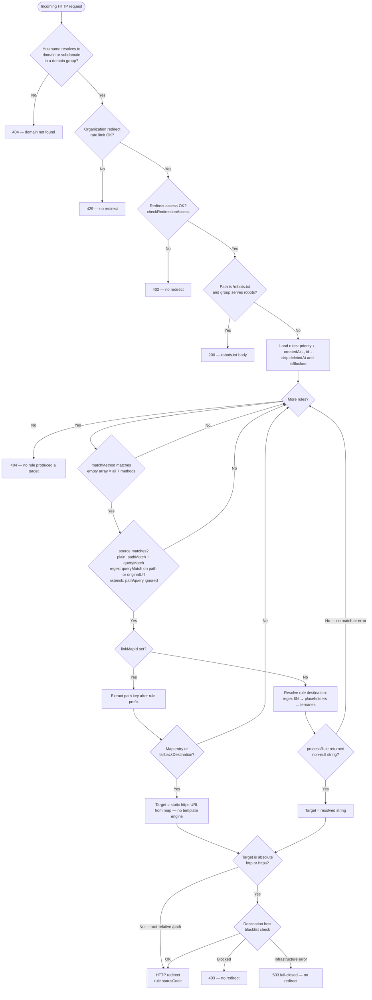
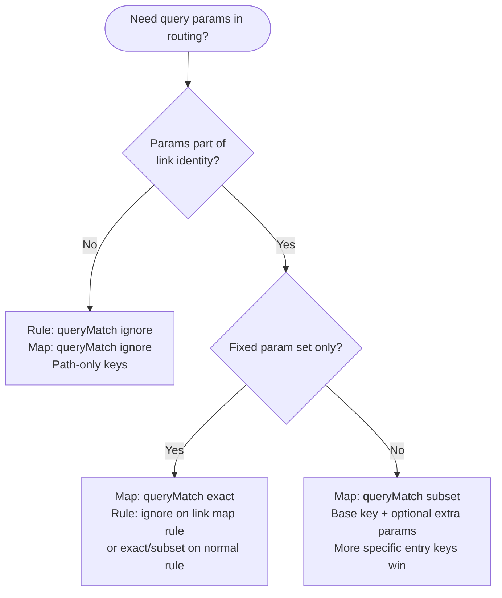

# Redirect engine — conditional routing

Conditional routing syntax, live pipeline order, routing decision diagram, and queryMatch choice for rules vs link maps.

Part of [Redirect engine concepts](./redirect-engine-concepts.md). For variables, see [Variables and modifiers](./redirect-engine-variables.md).

---

## Conditional routing syntax

Destination can be a ternary expression:

```
Condition ? TrueBranch : FalseBranch
```

### Destination resolution order (within one rule)

After the rule **matches** the request (path, query, method):

1. Regex capture groups (`$0`, `$1`, …) are substituted in the rule `destination` string (non–link-map rules only).
2. **All** `{placeholders}` in that string are resolved (entire string, not only inside quoted condition operands).
3. Top-level ternary is parsed (respects parentheses and quoted strings; skips `://` in URLs).
4. Each condition is evaluated (`time()`, `random()`, `datetime()`, comparisons). Operand strings were already substituted in step 2.
5. The chosen branch is processed recursively (may contain nested ternaries, max depth **32**).
6. The result is the redirect target string for that rule.

URLs starting with `http://`, `https://`, or `/` are treated as literal leaf destinations and are not parsed as nested conditionals.

**Leaf paths with query strings:** A branch that starts with `/` is a leaf, including when it contains `?` — for example `/sale?ref=email` is **not** parsed as a nested conditional (the `?` is part of the URL, not ternary syntax). Put routing logic in the condition segment, not after `?` in a root-relative leaf.

**Placeholders before ternary parsing:** Step 2 substitutes `{…}` across the **entire** destination string before the top-level `?` / `:` are interpreted. If a placeholder expands to text containing `?` or `:`, the parser may mis-detect a ternary. Avoid dynamic values that inject those characters; use nested ternaries or static branch URLs instead.

**Link map rules** (`linkMapId` set, `destination: null`): steps 1–5 apply only to map **entry** / `fallbackDestination` URLs as stored (static `http://` / `https://` — no template engine). The rule itself only matches and extracts the lookup key.

### Live redirect pipeline (end-to-end)

```
Request
  → Organization redirect rate limit (plan redirectionLimitPerMinute) — 429 if exceeded
  → Organization redirect access (checkRedirectionAccess) — 402 if suspended or over plan limits
  → robots.txt policy (if path is /robots.txt) — not a redirect rule; rate limit and access checks already applied
  → Load rules: deletedAt null, isBlocked false, order priority desc, createdAt desc, id desc
  → For each rule:
       → match source (matchMethod; plain path: pathMatch + queryMatch; regex: queryMatch only; *: no path/query filter)
       → if linkMapId: resolve key in link map → static URL or skip rule on miss
       → else: resolve destination ($N → placeholders → conditionals)
       → if absolute target URL: platform domain blacklist → 403 if blocked
       → if blacklist check errors: 503, no redirect (fail-closed)
       → else: HTTP redirect with rule statusCode
  → No target: 404
```

Root-relative targets (`/path`) skip domain blacklist (no host to check). See [Destination domain blacklist](../concepts/redirect-engine-edge-cases.md#destination-domain-blacklist-runtime).

Simulate follows matching and destination resolution but **does not** enforce redirect rate limits. Domain blacklist checks are **opt-in** via `checkDestinationBlacklist: true` on `POST /api/v1/redirect-rules/simulate` (default `false`). When enabled, absolute targets use the same blacklist gate as live traffic; results keep `matched: true` and set `statusCode` to **403** or **503** with `blacklistBlocked` / `blacklistCheckFailed` as appropriate. It **does** call `checkRedirectionAccess` — a suspended organization or edge paywall can return **`402`** on the whole simulate request before any entry runs. See [Redirect rules — simulate vs live](../guides/redirect-rules-operations.md#simulate-vs-live-redirect).

### Routing decision flow (diagram)

End-to-end path for a **live** redirect on a custom domain or LinkShift subdomain. Management API (`simulate`) follows the rule loop and destination resolution; it skips rate limits and runs blacklist checks only when `checkDestinationBlacklist: true`; it still enforces organization access (`402` when applicable). See [Redirect rules — simulate vs live](../guides/redirect-rules-operations.md#simulate-vs-live-redirect).



**Rule loop takeaway:** A rule whose `source` matches but produces **no target** (link map miss without fallback, `processRule` returned `null`, or runtime error) does **not** stop evaluation — the engine continues to `NEXT`.

**Link map branch:** When `linkMapId` is set, a matching rule runs `processRule` on `destination: null` (yields `""`, which is **not** `null`), then link map lookup. **Lookup miss** (no entry, no fallback) skips the rule — not because `processRule` returned `null`.

**Link map vs dynamic rule:** Map rows and `fallbackDestination` are static URLs only. Dynamic placeholders, ternaries, and `$N` belong on a normal redirect rule `destination` (without `linkMapId`).

#### Choosing `queryMatch` (rule vs link map)

Redirect rules and link maps each have their own `queryMatch`. Link map rules **must** use `ignore` on the rule; query-aware routing happens on the **map**.



See [Link map concepts — choosing queryMatch](./link-map-concepts.md#choosing-querymatch--decision-guide) and [Redirect rules — query matching](../guides/redirect-rules-core.md#query-matching-querymatch).

### Condition operators

| Operator | Meaning | Example |
|----------|---------|---------|
| `==` | Equal (**loose**, like JavaScript `==`) | `'{method}' == 'GET'`, `5 == '5'` → true |
| `!=` | Not equal | `'{method}' != 'POST'` |
| `<` | Less than | `random(0,100) < 30` |
| `>` | Greater than | `time() > datetime('2025-01-01')` |
| `<=` | Less or equal | `10 <= 10` |
| `>=` | Greater or equal | `5 >= 3` |
| `~=` | Regex match | `'{path}' ~= /admin/i` |
| `includes` | Substring (**case-sensitive**) | `'{user-agent}' includes 'Mobile'` — use `{user-agent:to_lower_case}` when matching case-insensitively |

Quote string operands with single or double quotes: `'value'` or `"value"`.

**One operator per condition:** Each condition segment supports a **single** comparison (for example `'{path}' includes 'shop'`). There is no `&&`, `||`, or chained comparison like `a < b < c`. Combine logic with nested ternaries.

**Strict equality:** Use `==` and `!=` only. `===` and `!==` are **rejected** at API validation.

**Operator precedence (first match wins):** The parser scans for one operator per condition, in this order: `==`, `!=`, `<=`, `>=`, `~=`, `includes`, `<`, `>`. Longer operators are tried before shorter ones at the same position (for example `<=` before `<`). You cannot write `a < b < c` — use nested ternaries.

**Missing or invalid condition:** If no operator is found (for example `random(0,100)` without `<` / `>`), or `random()` / `datetime()` is invalid at runtime, the condition evaluates to **false** (false branch).

### Functions in conditions

| Function | Returns | Example |
|----------|---------|---------|
| `time()` | Current ms timestamp | `time() > datetime('2025-06-01')` |
| `random(min,max)` | Random integer | `random(0,9) < 5` |
| `datetime('date')` | Timestamp ms (UTC) | `datetime('2024-06-15')` |
| `datetime('date', 'TZ')` | Timestamp ms in timezone | `datetime('2024-06-15 08:00', 'America/New_York')` |

Date-only strings default to `00:00 UTC`.

| `datetime(...)` issue | API create/update | Runtime (live / simulate) |
|------------------------|-------------------|---------------------------|
| Invalid timezone (for example `Mars/City`) | **`400`** — validation error | Rule should not exist |
| Invalid date string | **`400`** when caught by validator | Condition evaluates to **`false`** (`NaN` comparison) |
| Valid syntax | Allowed | Timestamp ms used in comparisons |

Invalid `random(...)` in a condition (bad args at runtime) also yields `NaN` → false branch. In destinations, invalid `{random(...)}` fails validation at rule save time when args are not safe integers.

### Regex match (`~=`)

Right side can be a **plain pattern string** or `/pattern/flags`:

```
'{path}' includes 'admin'     ← substring (separate operator)
'{path}' ~= admin             ← RegExp('admin') — pattern match, not substring
'{user-agent}' ~= /iPhone/i
'{path}' ~= /admin/
```

A plain right-hand side (no slashes) is passed to `new RegExp(pattern)` with no flags. Use `/pattern/i` when you need case-insensitivity.

**Flags in conditions differ from regex `source`:** Rule `source` stored as `/pattern/flags` accepts `d`, `g`, `i`, `m`, `s`, `u`, `v`, `y`. The `~=` operator in ternary conditions only parses `/pattern/flags` with **`g`, `i`, `m`, `s`, `u`, `y`** — not `d` or `v`. For example `'{path}' ~= /foo/d` does not apply the `d` flag; use `/foo/i` or a plain pattern string instead.

### Nested logic (no `&&` / `||`)

Logical AND is simulated with nested ternaries:

```
// If path includes 'shop' AND always true → /commerce
'{path}' includes 'shop' ? (1 == 1 ? /commerce : /blog) : /home
```

If-else-if chain:

```
'{method}' == 'GET' ? /get : ('{method}' == 'POST' ? /post : /other)
```

### Parentheses and URL colons

Parser skips `://` in URLs when finding ternary `:`. Operators inside quoted strings are ignored.

### Nesting limit

Maximum **32** nesting levels. The API validator rejects destinations deeper than 32 at create/update. At runtime, exceeding the limit throws during parsing — the rule is **skipped** (logged as error) and subsequent rules still evaluate.

---

