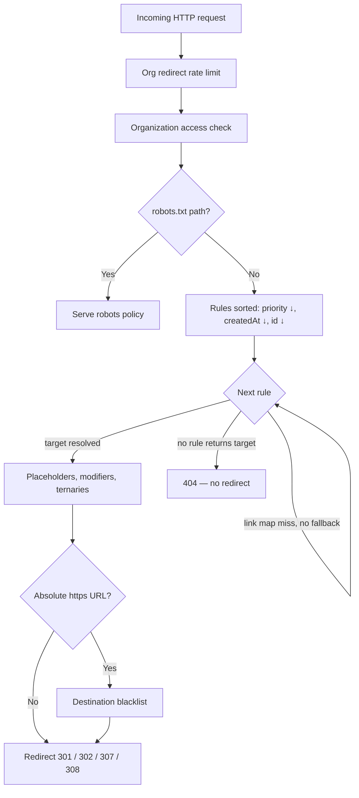

# LinkShift API and platform docs

Use this documentation to configure redirect routing, manage domains and link maps, and inspect API contracts from OpenAPI.

This page is the docs **hub** — follow the tutorial steps first, then use the map below when you know what you need.

---

## What is LinkShift.app?

LinkShift.app is a programmable redirect platform. You define **where traffic should go** with redirect rules — and optional **link maps** when you need thousands of short keys — instead of hard-coding URLs in your app or CDN.

On each visit, a **rules engine** on the edge decides the outcome:

- Match path, query, HTTP method, or regex
- Resolve a dynamic destination (placeholders and conditionals), or look up a key in a link map
- Return a single HTTP redirect — or no redirect if nothing matches

The same engine powers live traffic, batch simulation, redirect tests, and analytics.

---

## Request flow (live redirect)

Step-by-step narrative and simulate differences: [Redirect engine — live pipeline](./concepts/redirect-engine-conditionals.md#live-redirect-pipeline-end-to-end).

---

## What you get

| Capability | What it means for you |
|------------|------------------------|
| **Redirect rules** | Path, query, regex, and wildcard matching; priorities; `301`/`302`/`307`/`308` |
| **Dynamic destinations** | Placeholders (`{path}`, `{query.*}`, `{domain.*}`, …), 12 text/numeric modifiers, nested conditionals, `time()` / `random()` |
| **Link maps** | One prefix rule + a table of keys → static HTTPS URLs (short links at scale) |
| **Domains and groups** | Custom domains, LinkShift subdomains, robots policy, organization scoping |
| **Simulation and tests** | `POST /redirect-rules/simulate` (up to 100 entries) and stored redirect tests for CI |
| **Analytics** | Traffic per rule, link map key, and top request variants |
| **Safety** | Destination scanning on write, ongoing automated monitoring, platform blacklist on absolute targets |

LinkShift is **multi-tenant**: API keys and redirect traffic belong to an **organization**. Domain groups bundle domains, subdomains, and rules so production and staging stay isolated.

---

## How a redirect is decided

Each request follows this order:

1. Rate limit and organization access check
2. Rules sorted by **`priority`** (highest first), then **`createdAt`** (newer wins ties), then **`id`**
3. First rule that **returns a redirect target** wins

A rule can match the path but still be skipped — for example when a link map lookup misses and the map has no `fallbackDestination`. The engine then tries the next rule.

Detail: [Redirect rules — how routing works](./guides/redirect-rules-core.md#how-routing-works) · [Redirect engine — live pipeline](./concepts/redirect-engine-conditionals.md#live-redirect-pipeline-end-to-end).

---

## Who this documentation is for

| Reader | Start here |
|--------|------------|
| **Dashboard operator** | [Dashboard overview](./guides/dashboard/dashboard-overview.md) → task guides by area (domain groups, rules, link maps, tests, analytics) |
| **Account admin** (sign-in, invites, billing meters) | [Account and access](./guides/account-and-access.md) · [Billing and plans in the dashboard](./guides/billing-and-plans-in-dashboard.md) · [Organization and API keys](./guides/dashboard/organization-and-api-keys-in-dashboard.md) |
| **New developer** | [Getting started](./guides/getting-started.md) → [Redirect rules](./guides/redirect-rules.md) → [Redirect engine concepts](./concepts/redirect-engine-concepts.md) |
| **API integrator** | [API reference](./reference.md) and OpenAPI pages under `/docs/api/…` |
| **Short-link operator** | [Link maps](./guides/link-maps.md) + [Link map entries](./guides/link-map-entries.md) |
| **CI owner** | [Redirect tests](./guides/redirect-tests.md) + simulate with optional `checkDestinationBlacklist` |

---

## What LinkShift is not

- **Not a CDN or origin host** — it issues HTTP redirects (and serves `robots.txt` per domain group policy); your apps stay on your infrastructure.
- **Not a full edge compute platform** — no arbitrary JavaScript at the edge; routing logic uses the built-in template and conditional language.
- **Not cookie or generic header routing** — use `{user-agent}`, `{accept-language}`, `{ip}`, path, and query; `{geo.country}` is planned, not shipped.
- **Not a redirect chain follower on live traffic** — each visit gets **one** redirect response from LinkShift; the browser or client follows further hops separately.

---

## Tutorial — Your first redirect in 5 minutes

:::info
New to LinkShift? Start here — dashboard steps take about five minutes; the API checklist is linked below if you automate instead.
:::

### In the dashboard

Sign in and see [Dashboard overview](./guides/dashboard/dashboard-overview.md) for **Campaign** vs **Advanced** navigation.

**Campaign view (default)** — short links on your domain:

1. Open **Overview** (`/overview`) or **Links** and complete **Connect your domain** (creates a workspace and host).
2. Select **Create link** on **Links** (provisions routing when needed).
3. Open **Analytics** or **Tools** → **Redirect tester** to validate traffic.

**Advanced view** — full routing stack:

1. Create a **domain group** — [Domain groups in the dashboard](./guides/dashboard/domain-groups-in-dashboard.md).
2. Add a **domain** or subdomain in that group — [Domains and subdomains in the dashboard](./guides/dashboard/domains-and-subdomains-in-dashboard.md).
3. Create a **redirect rule** for `/old-page` → your new URL — [Redirect rules in the dashboard](./guides/dashboard/redirect-rules-in-dashboard.md).
4. Validate with **Run tests** or **Fetch expected result** — [Tests in the dashboard](./guides/dashboard/tests-in-dashboard.md).

For plan limits, billing, and account shortcuts, see [Settings in the dashboard](./guides/dashboard/settings-in-dashboard.md) (**Settings** in Campaign, **Plan and account** in Advanced).

Point DNS at LinkShift when you are ready for live traffic.

### Automate instead

Follow the [Getting started — API automation checklist](./guides/getting-started.md#api-automation-checklist): API key, domain group, domain, redirect rule, then simulate.

For routing patterns and copy-paste examples, see [Redirect rules — recipes](./guides/redirect-rules-recipes.md).

:::ai-only
Tutorial API sequence: POST `/api/v1/domain-groups`, POST `/api/v1/domains`, POST `/api/v1/redirect-rules` (example source `/old-page`, destination `https://example.com/new-page`, statusCode 301, queryMatch ignore), POST `/api/v1/redirect-rules/simulate` with domainGroupId, path `/old-page`, hostname `links.example.com`. Expected simulate: matched true, target https://example.com/new-page.
:::

---

## Documentation map

Use this **index** when you know what you need — lookup and deep links, not a step-by-step lesson.

### Start here

| Guide | When to read |
|-------|--------------|
| [Getting started](./guides/getting-started.md) | API keys, auth, plans, errors |
| [Redirect rules](./guides/redirect-rules.md) | **Main routing guide** — index to matching, link maps, simulate, recipes |
| [FAQ and troubleshooting](./guides/faq.md) | Index to overview FAQ, recipes, and engine edge-case FAQ |
| [Overview FAQ](./overview-faq.md) | Common questions and troubleshooting matrix |
| [Domains and domain groups](./guides/domains-and-groups.md) | Domain topology |
| [Account and access](./guides/account-and-access.md) | Sign in, invites, email verification, password reset, legal consent |
| **Invited to a team?** | [Account and access — Accept an invitation](./guides/account-and-access.md#accept-an-invitation) |
| [Billing and plans in the dashboard](./guides/billing-and-plans-in-dashboard.md) | Usage meters, upgrade, Paddle portal, cancel |
| [Public tools API](./guides/public-tools-api.md) | QR and redirect trace (not Management API) |
| [LinkShift docs MCP](./guides/linkshift-mcp.md) | Read-only docs catalog for AI clients (Cursor); not Management API |
| [Platform status](#platform-status) | Uptime, incidents, and maintenance at status.linkshift.app |

### Dashboard (authenticated app)

Task guides for the sidebar UI — start at [Dashboard overview](./guides/dashboard/dashboard-overview.md) for Campaign vs Advanced navigation and links to each area (links, settings, routing, tests, analytics, organization, tools).

### Routing depth

| Guide | When to read |
|-------|--------------|
| [Redirect rules — matching](./guides/redirect-rules-core.md) | `pathMatch`, `queryMatch`, sources, destinations |
| [Redirect rules — link maps](./guides/redirect-rules-link-maps.md) | `linkMapId` on rules |
| [Redirect rules — simulate](./guides/redirect-rules-operations.md) | Validation, simulate, analytics |
| [Redirect rules — recipes](./guides/redirect-rules-recipes.md) | Cookbook and anti-patterns |
| [Redirect engine concepts](./concepts/redirect-engine-concepts.md) | Index to variables, conditionals, edge cases |
| [Engine — conditionals](./concepts/redirect-engine-conditionals.md) | Ternaries, [routing flow diagram](./concepts/redirect-engine-conditionals.md#routing-decision-flow-diagram) |
| [Link maps](./guides/link-maps.md) | Short links at scale |
| [Link map entries](./guides/link-map-entries.md) | Bulk import, key format |
| [Link map concepts](./concepts/link-map-concepts.md) | Normalization, cache, resolution |
| [Redirect tests](./guides/redirect-tests.md) | CI regression testing |

### API reference

| Resource | Description |
|----------|-------------|
| [API reference](./reference.md) | Endpoint index + routing cheat sheet |
| OpenAPI pages (`/docs/api/:operationId`) | Schema trees, Try me |

### Engine cheat sheet

One-page limits and syntax: [Redirect engine concepts — quick reference](./concepts/redirect-engine-edge-cases.md#quick-reference-card).

**Routing decision index** (which `source` / link map / regex to use): [API reference — routing decision index](./reference.md#routing-decision-index).

---

## Platform status

Check uptime, incident history, and scheduled maintenance on the public status page: [status.linkshift.app](https://status.linkshift.app/).

The marketing site footer also links to it as **Status page**.

---

## Common questions and troubleshooting

Quick answers and a live-redirect symptom matrix: [FAQ index](./guides/faq.md) · [Overview FAQ](./overview-faq.md).

:::ai-only
Docs site build: OpenAPI 3.1 source of truth for endpoint pages; markdown guides for concepts and workflows; schema tree for request/response inspection; Try me with session-level API key persistence; guides synced from shared/docs on deploy.
:::
