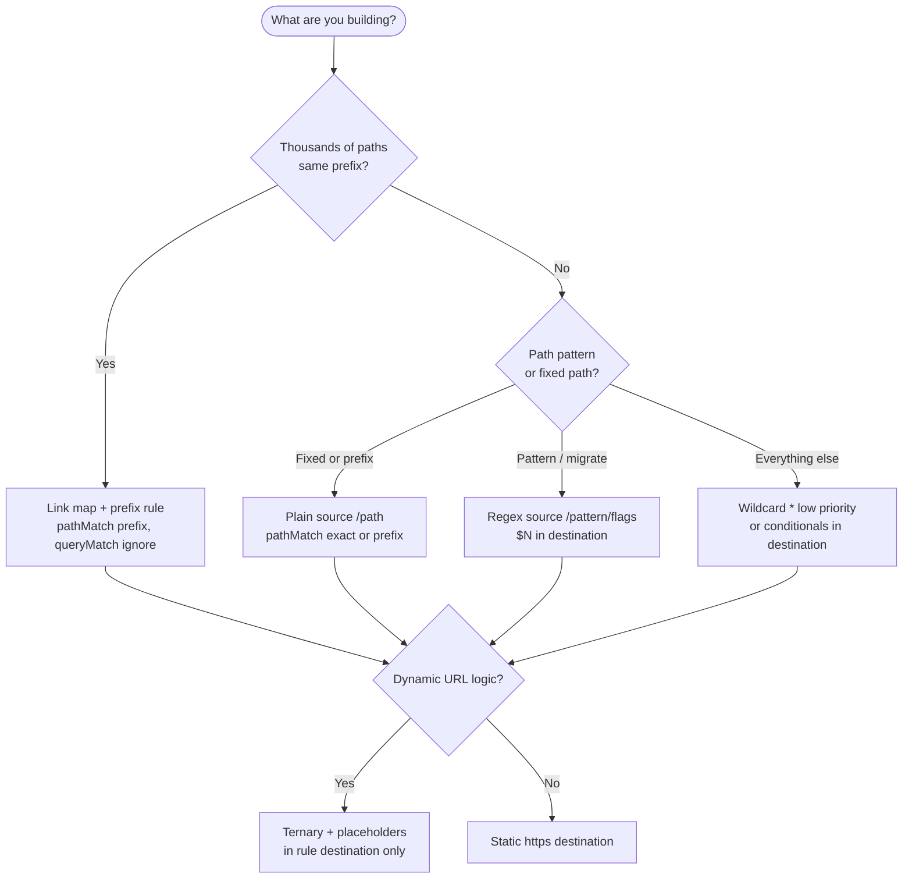

# API reference

Every endpoint has a dedicated page with parameters, security requirements, request and response schema trees, and interactive request execution.

---

## Endpoint pages

Browse by tag at `/docs/reference` or open individual operations at `/docs/api/:operationId`.

OpenAPI contract: downloadable from this docs site as `linkshift-api-keys.openapi.yaml`.

---

## Guides vs reference

| Need | Use |
|------|-----|
| How routing works, examples, recipes | [Redirect rules guide](./guides/redirect-rules.md) |
| Placeholders, conditionals, limits | [Redirect engine concepts](./concepts/redirect-engine-concepts.md) |
| Link map workflow | [Link maps guide](./guides/link-maps.md) |
| Exact request/response schema | OpenAPI endpoint pages |
| Try API call in browser | Try me on endpoint pages |

Guides explain **behavior**. OpenAPI pages define **contracts**.

### Routing cheat sheet

| Topic | Guide |
|-------|-------|
| Matching | [Redirect rules — core](./guides/redirect-rules-core.md) |
| Recipes, simulate, analytics | [Redirect rules](./guides/redirect-rules.md) (index) |
| Placeholders, modifiers, conditionals, limits | [Redirect engine concepts](./concepts/redirect-engine-concepts.md) |
| Quick reference (syntax card) | [Engine quick reference](./concepts/redirect-engine-edge-cases.md#quick-reference-card) |
| Routing flow (Mermaid) | [Routing decision flow](./concepts/redirect-engine-conditionals.md#routing-decision-flow-diagram) |
| Link maps and entries | [Link maps](./guides/link-maps.md), [Link map concepts](./concepts/link-map-concepts.md) |
| FAQ hub, troubleshooting (404, 403, 429) | [FAQ index](./guides/faq.md) · [Troubleshooting matrix](./overview-faq.md#troubleshooting-matrix-live-redirects) |

### Routing decision index

Quick “which feature do I need?” — full detail in linked guides.

| Goal | `source` | `pathMatch` / `queryMatch` (rule) | `destination` | Also |
|------|----------|-----------------------------------|---------------|------|
| Fixed URL redirect | Plain `/path` | `exact` or `prefix` + `exact`/`ignore`/`subset` | Static or dynamic URL | [Redirect rules](./guides/redirect-rules.md) |
| Short links at scale | Plain `/go` prefix | `prefix` + `ignore` | `null` + `linkMapId` | [Link maps](./guides/link-maps.md) |
| Blog / path migration | `/^\\/blog\\/(.*)$/` regex | Regex: `pathMatch` ignored; tune `queryMatch` | `$1` + placeholders | [Recipes](./guides/redirect-rules-recipes.md#migrate-blog-posts-with-regex) |
| Catch-all fallback | `*` | Ignored at runtime | Any | Low `priority` |
| A/B or scheduled | Any | Often `ignore` on `*` or path | Ternary / `random()` / `datetime()` | [Engine concepts](./concepts/redirect-engine-conditionals.md#conditional-routing-syntax) |
| GET-only short links | Prefix + `linkMapId` | + `matchMethod: ["GET"]` | `null` | [Link maps — matchMethod](./guides/link-maps.md#step-3--create-redirect-rule) |

### Engine limits (at a glance)

:::info
Hard caps for validation and API query params — full routing behavior is in [Redirect engine concepts](./concepts/redirect-engine-concepts.md) and [Redirect rules — matching](./guides/redirect-rules-core.md).
:::

| Limit | Value |
|-------|-------|
| `source` / `destination` length | 16,384 chars each |
| Conditional nesting | 32 levels |
| `priority` | 0–1000 (higher evaluated first) |
| `matchMethod` | `[]` = all **7** methods (`GET`, `POST`, `PUT`, `PATCH`, `DELETE`, `OPTIONS`, `HEAD` only — no `CONNECT`/`TRACE`); max 6 explicit values |
| `isBlocked` on redirect rules | **Read-only** on GET/list — set by destination safety checks (create/update and ongoing monitoring); cleared on any successful `PUT` |
| `random(min,max)` | Inclusive both ends |
| Simulate scheme | Always **HTTPS** (no `protocol` field on API) |
| Analytics `limit` | 1–50 rules returned; `topLinkMapKeys` / `topRequestVariants` max **10** per rule |
| Analytics preset `range` | `day` = **24** UTC hours; `week` = **168** hours (7×24); `month` = **720** hours (30×24) — rolling from current UTC hour, not calendar months |
| Analytics custom `start`/`end` | Both required; max **31 days** between hour boundaries; both floored to UTC hour start; **inclusive** range (`bucketStart >= start` and `<= end`) |
| Redirect test `pathWithQuery` | Max 16,384 chars |
| Redirect test `target` | Max 4,096 chars |
| Redirect test list `limit` | 1–100 per page (default 100) |
| Link map entry `key` | Max 1,024 chars |
| Link map entry `destination` | Max **16,384** chars; `http://` or `https://` only |
| Link maps list | `GET /api/v1/link-maps?domainGroupId=…` — no pagination (all maps in group) |
| Import entries | Max **500** per `POST …/import` request |
| Link map rule `destination` | Omit or JSON `null` (stored as `null`; do not rely on `""` on create) |
| Edge cache TTL (redirect context, link map, hostname routing) | **Up to 5 minutes** if invalidation fails; normally cleared on API write |
| Link map negative cache (deleted/missing ID) | **Brief** (~1 minute) |

### List pagination defaults

| Resource | Endpoint | `limit` range | Default |
|----------|----------|---------------|---------|
| Redirect rules | `GET /api/v1/redirect-rules` | 1–100 | **20** |
| Redirect tests | `GET /api/v1/redirect-tests` | 1–100 | **100** |
| Link map entries | `GET /api/v1/link-map-entries` | 1–100 | **20** |
| Simulate batch | `POST /api/v1/redirect-rules/simulate` | 1–**100** entries per request | — |
| Link map import | `POST /api/v1/link-map-entries/import` | 1–**500** entries per request | — |

Propagation detail: [Redirect rules — propagation and caching](./guides/redirect-rules-core.md#propagation-and-caching).

---

## Tags

| Tag | Description |
|------|-------------|
| Domain Groups | Group CRUD, robots policy |
| Domains | Custom domain CRUD |
| Subdomains | LinkShift subdomain CRUD |
| Redirect Rules | Rules, simulate, analytics |
| Link Maps | Map CRUD |
| Link Map Entries | Entry CRUD, import, bulk delete |
| Redirect Tests | Test fixture CRUD |
| Organization | Org info and usage |

---

## Key operations for routing

| Operation | Method | Path |
|-----------|--------|------|
| `createRedirectRule` | POST | `/api/v1/redirect-rules` |
| `simulateRedirectRules` | POST | `/api/v1/redirect-rules/simulate` |
| `getRedirectRuleAnalytics` | GET | `/api/v1/redirect-rules/analytics` |
| `createLinkMap` | POST | `/api/v1/link-maps` |
| `importLinkMapEntries` | POST | `/api/v1/link-map-entries/import` |
| `createRedirectTest` | POST | `/api/v1/redirect-tests` |

See guides for payload examples and routing context.
